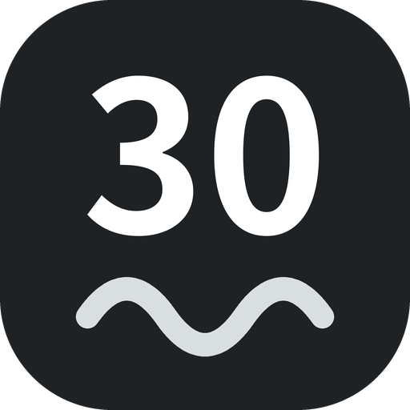

  

<h1 align="center">30-ish</h1>

<b>差不多 30 分鐘，動就對了。</b> 幫你記住動作順序的運動菜單與計時器。

---

## 這是什麼？

想養成運動習慣，卻老是忘記「今天要做什麼動作、順序是什麼」？

**30-ish** 是一個單一檔案的網頁小工具。你把動作排成一份 30 分鐘的菜單，開始運動後，它會自動倒數、提醒下一個動作，並幫你記錄有沒有持續運動。

每份菜單分成三段：

| 階段 | 時間 |
|---|---|
| 暖身 | 5 分鐘 |
| 主訓練 | 20 分鐘 |
| 收操 | 5 分鐘 |

## 功能

- **主頁儀表板**：本週、本月、總次數；點進去可看本週打勾、整月日曆、每月進度條
- **自訂菜單**：每個動作設定「持續幾秒」和「休息幾秒」，可複製、可拖曳排序（也能拖到其他階段）
- **運動計時**：自動輪播動作與休息，顯示下一個動作與剩餘時間，有提示音、語音與震動
- **鼓勵的話**：開啟時與完成後給你一句肯定
- **提前結束也算數**：做不完也沒關係，有動就很好
- **運動狀態紀錄（選填）**：平均心率、動作品質 1–5、RPE 1–10，並顯示最近 6 週平均
- **搜尋與篩選**：用動作名稱搜尋、用標籤篩選菜單
- **菜單分享與匯入**：一鍵複製菜單文字給朋友，對方貼上即可加入
- **備份與還原**：一鍵複製備份文字，換裝置也不怕資料遺失
- **手機友善**：可在手機瀏覽器直接使用

## 開始使用

1. 打開網址：`https://luinprogress.github.io/30-ish/`
2. 在「菜單」頁選一份菜單（或新增自己的）
3. 回到「主頁」，按「開始運動」

## 分享菜單給朋友

1. 在「菜單」頁，找到想分享的菜單，按「**分享**」
2. 把複製好的整段文字貼給朋友
3. 朋友在自己的 30-ish 按「**匯入**」，貼上就能加進他的菜單

匯入只會新增一份菜單，不會動到對方原本的菜單和運動紀錄。

## 備份你的資料

你的菜單和紀錄只存在**這個瀏覽器**裡。換手機、換瀏覽器或清除瀏覽器資料，都可能讓資料消失，所以請定期備份：

1. 到「目標與備份」頁，按「**複製備份**」
2. 把文字貼到備忘錄或傳給自己保存
3. 要還原時，把文字貼回輸入框，按「**匯入備份**」

> 匯入備份會**取代**目前所有菜單與紀錄，請先確認。

## 隱私

- 沒有後端、不需要註冊或登入
- 所有資料都存在你自己的瀏覽器（localStorage），不會上傳到任何伺服器
- 每個人的資料各自獨立，彼此看不到

## 小提醒

- 聲音與語音提示依瀏覽器與手機設定而定。iPhone 請確認側邊靜音鍵沒有開、媒體音量有調高；也可以按計時畫面右下角的 🔊 開關
- 運動時畫面會盡量保持不熄滅，但不同瀏覽器的支援程度不同

---

動一點點，也算數。🌿

